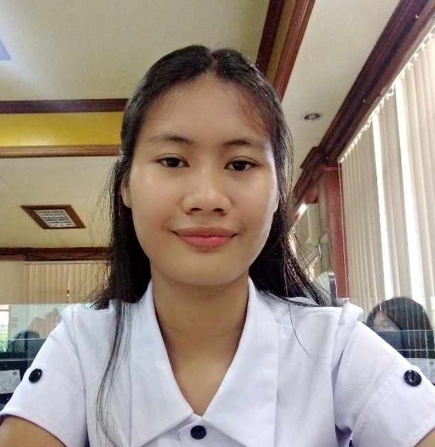

<html lang="en">

    <meta charset="UTF-8">
    <meta name="viewport" content="width=device-width, initial-scale=1.0">
    <title>My Resume</title>
    </head>
    
</head>
<body>

    <header>
        
    </header>

    

        

	

	
	    <h1>Emerald Mae Charity Alamat</h1>
	    

	    <h1>Computer Science</h1>
        

     
    
<h2>About Me</h2>
        
I am Emerald Mae Charity G. Alamat I was studied Humanities and Social Sciences at Titay Senior High School, 
			by studying (HUMSS) i was able to gained the skills of Public Speaking doing Good Communication and spending my world in writing poetry and i am interested
			in playing instrument like guitar,flute and piano and also it is in my habbit to play chess and do solving problem.
			In this current time i am studying Computer Science because i want to gain skills in computer.
		
		

        

        
        
<h2> Interest:</h2>
        <li> Chess</li>
        <li> Solving Problem</li>
        <li> Listening Music</li>
        <li> Poetry</li>
        <li> English Literature</li>
        <li> Climbing Mountain</li>
        <li> Camping</li>

<h2>Achievements:</h2>
<li>Certificate of Girls Scout of The Philippines</li>
        <li> Certificate of Academic Exellence</li>
        <li> Certificate of Regional Chess Player (ZPRAA meet)</li>
        <li> Certificate of Provencial Chess player</li>
        <li> Certificate of Outstanding Research/Silver medal</li>
        <li> Certificate of Gospel Speaker</li>
        

        <h2>Skills:</h2>

    
                <li>C++</li>
                <li>HTML</li>
                <li>Research</li>
                <li>Communication</li>
                <li>Analytical & Critical Thinking</li>
                <li>Creativity</li>
                <li>Leadership</li>
                <li>Problem Solving</li>
                <li>Decision Making</li>
				<li>Time Management</li>
      

      

	 

        

			
			<h2>Career Objective:</h2>   
			<li> As a Computer Science student, my career objective is to leverage my technical skills and knowledge to contribute to the development and advancement of innovative technologies.
				I aim to work in a dynamic and challenging environment where i can apply my problem-solving abilities and collaborate with a team of professionals to create impactful solutions.
			With a strong foundation in computer science principles,programming languages, and data analysis, I aspire to continuesly learn and adapt to emerging technologies, ultimately making a positive impact on society through my work. </li>
			
	
			
	    <h2>Personal Information:</h2>
            
Birthdate: April 23, 2004

            
Birthplace: Gutalac Zamboanga del Norte

            
Age: 19

            
Height: 5'2

            
Weight: 43

            
Civil Status: Single

            
Citizenship: Filipino

            
Father's Name: Eugenio A. Alamat

            
Mother's Name: Greta G. Alamat

            
Religion: Seventh-Day Adventist

            
Language: Bisaya, Tagalog, English

	

            <h2>Contact Information:</h2>
            
📧: emeraldmaecharityalamat@gamil.com

            
📞: 963 132 1612

			
	

            <h2>Education:</h2>
	<h3>Primary:</h3>
	    
Titay Central Elementary School Z.S.P.

	<h3>Secondary:</h3>
            
Titay National High School, Poblacion, Titay Z.S.P.

            <li>Studied - AGRI-CROP PRODUCTION
	    
Titay Senior High School, Poblacion, Titay Z.S.P.

        <li>Studied - HUMANITIES AND SOCIAL SCIENCES</li>
        <h3>Tertiary</h3>
       
 Jose Rizal Memorial State University-TC

        <li>Studies - Bachelor Of Science in Computer Science
	

	    <h2>Address:</h2>
	    
Hometown:Poblacion Titay, Zamboanga Sibugay

        
Current Address: ZNAC Tampilisan, Zamboanga del Norte

		
	    

            

